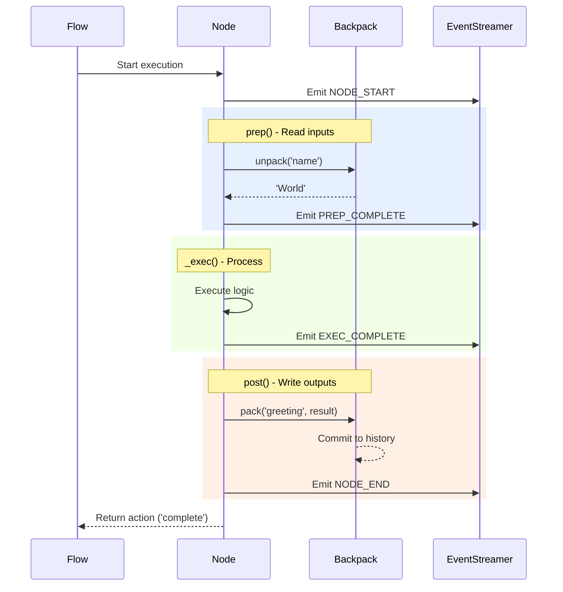

# 🎒 BackpackFlow

A TypeScript-first, config-driven LLM framework built on top of [PocketFlow](https://github.com/The-Pocket/PocketFlow-Typescript).

**BackpackFlow** extends PocketFlow with a specific philosophy: **The Code is the Engine, the Config is the Steering Wheel.**

[](https://badge.fury.io/js/backpackflow)
[](https://opensource.org/licenses/Apache-2.0)

> **⚡ v2.0 "The Observable Agent"** - Build production-ready AI agents with complete observability, Zod-based type safety, and nested flow composition. TypeScript-first, config-driven, and ready for visual builders.

---

## 🚫 The Pain Points (Why BackpackFlow Exists)

Most LLM development hits three major walls:

### 1. **The "Black Box" State**
In many frameworks, context (history, variables) is handled by "magic." You don't know exactly what the LLM can "see" at any given step. Debugging feels like "doing animal experiments."

### 2. **The "No-Code" Wall**
Visual builders are great for demos, but when you need complex loops or custom logic, you hit a wall. You can't "eject" to code easily, and your flow is trapped in the GUI.

### 3. **The Language Barrier**
Python is great for data science, but if you want to build a **web-based tracer** or a **drag-and-drop UI**, you end up duplicating types between your Python backend and React frontend.

---

## 💡 The BackpackFlow Solution

We solve these pain points with a **TypeScript-First, Config-Driven** architecture.

### 1. "Git for Your Agent's State" (Solves Black Box State)

**Think of Backpack as "Git for your agent's memory."**

Just like Git tracks every code change with commits, Backpack tracks every data change in your agent:

```mermaid
graph LR
    subgraph Git["🔧 Git (Code Versioning)"]
        G1["git commit"] 
        G2["git log"]
        G3["git checkout abc123"]
        G4["git diff"]
    end
    
    subgraph Backpack["🎒 Backpack (State Versioning)"]
        B1["backpack.pack('key', value)"]
        B2["backpack.getHistory()"]
        B3["backpack.getSnapshot()"]
        B4["backpack.diff(before, after)"]
    end
    
    G1 -.->|"Same Concept"| B1
    G2 -.->|"Same Concept"| B2
    G3 -.->|"Same Concept"| B3
    G4 -.->|"Same Concept"| B4
    
    style Git fill:#f0f0f0,stroke:#333,stroke-width:2px
    style Backpack fill:#e3f2fd,stroke:#1976d2,stroke-width:2px
```



**Why "Backpack"?** Because your agent **carries explicit data** from node to node:
- 🎒 Nothing is hidden - if it's not in the Backpack, the agent can't use it
- 🔍 Every item is **tagged** with who packed it, when, and why
- 🚫 Nodes declare **access permissions** - can't accidentally read debug data or PII
- ⏱️ Complete **audit trail** - trace any data back to its source

**The Result:** Instead of debugging "black box" state mutations, you have:

- ✅ **Immutable History** - Every data change is tracked (like Git commits)
- ✅ **Time-Travel Debugging** - Rewind to any previous state (`git checkout`)
- ✅ **Complete Auditability** - Know exactly who changed what, when (`git blame`)
- ✅ **Access Control** - Nodes declare what they can read/write (unlike SharedStore)

**If Git made code development manageable, Backpack makes agent development manageable.**

### 2. Code-First, UI-Ready (Solves the No-Code Wall)

We are building a "bridge" where **Code** and **Config** are interchangeable.

- **The Engine:** You write complex logic in TypeScript Nodes
- **The Steering Wheel:** The framework serializes your Nodes into JSON Config
- **The Result:** Build a **UI Layer** that can visualize and edit your flow, but allows you to "eject" to raw code whenever needed


### 3. TypeScript-First (Solves the Language Barrier)

Build your backend logic AND your web UI in the same language. Share types, schemas, and validation logic seamlessly.

---

## 📍 Current Version: v2.0.0

**"The Observable Agent"** - Complete rewrite with production-ready observability

- **Architecture**: Git-like state management with immutable history
- **Type Safety**: Full Zod schema validation with type inference
- **Observability**: Automatic event emission and time-travel debugging
- **Composition**: Nested flows with recursive serialization
- **Config-Driven**: Complete JSON serialization for visual builders

👉 **[See Full Roadmap](./ROADMAP.md)** | **[Migration from v1.x](./docs/v2.0/migration/MIGRATION-v1-to-v2.md)**

## ✨ Features

### Core Architecture (v2.0)

#### 🎒 Backpack: Git-Like State Management
[📚 Documentation](./docs/v2.0/prds/PRD-001-backpack-architecture.md)

Think of it as **"Git for your agent's memory"** - every data change is tracked with full history:

- **Immutable History**: Every state change recorded like Git commits
- **Time-Travel Debugging**: Rewind to any previous state to see what the agent "knew"
- **Source Tracking**: Know exactly which node added/modified each piece of data
- **Access Control**: Nodes declare what they can read/write with wildcard support
- **State Quarantine**: Isolate failed operations from downstream nodes

```mermaid
%%{init: {'theme':'base'}}%%
timeline
    title Backpack State History (Like Git Log)
    section Node A
        Commit 1 : pack('query', 'AI agents')
    section Node B
        Commit 2 : pack('results', [...])
        Commit 3 : pack('filtered', [...])
    section Node C
        Commit 4 : pack('summary', 'Analysis...')
    section Time-Travel
        Checkpoint : getSnapshot() → Rewind to any point
```



#### 📡 Event Streaming: Complete Observability
[📚 Documentation](./docs/v2.0/prds/PRD-002-telemetry-system.md)

Automatic event emission for every node lifecycle event - no manual logging needed:

- **5 Event Types**: `NODE_START`, `PREP_COMPLETE`, `EXEC_COMPLETE`, `NODE_END`, `ERROR`
- **Prompt Inspection**: See exact LLM prompts via `PREP_COMPLETE` events
- **Parse Error Visibility**: Inspect raw responses before JSON parsing fails
- **Namespace Filtering**: Subscribe to events with wildcard patterns
- **Event History**: Built-in event storage for post-mortem debugging

```mermaid
graph LR
    A[NODE_START] --> B[PREP_COMPLETE]
    B --> C[EXEC_COMPLETE]
    C --> D[NODE_END]
    
    B -.->|"Error in prep()"| E[ERROR]
    C -.->|"Error in _exec()"| E
    
    B -->|"📋 Emits"| B1["Input data<br/>LLM prompts"]
    C -->|"📋 Emits"| C1["Execution result<br/>Raw LLM response"]
    D -->|"📋 Emits"| D1["Final action<br/>Duration"]
    E -->|"📋 Emits"| E1["Error details<br/>Stack trace"]
    
    style A fill:#4caf50,stroke:#333,color:#fff
    style D fill:#2196f3,stroke:#333,color:#fff
    style E fill:#f44336,stroke:#333,color:#fff
    style B1 fill:#fff3cd,stroke:#856404
    style C1 fill:#fff3cd,stroke:#856404
    style D1 fill:#d1ecf1,stroke:#0c5460
    style E1 fill:#f8d7da,stroke:#721c24
```



#### 🔌 Config-Driven Architecture
[📚 Documentation](./docs/v2.0/prds/PRD-003-serialization-bridge.md)

Bidirectional conversion between TypeScript code and JSON configs:

- **JSON Serialization**: Export complete flows to JSON for storage/transfer
- **Type-Safe Loading**: Zod-validated configs prevent runtime errors
- **Dependency Injection**: Clean handling of non-serializable objects (LLM clients, DBs)
- **Round-Trip Guarantee**: `fromConfig(toConfig())` preserves node identity
- **UI-Ready**: Foundation for drag-and-drop flow builders

```mermaid
graph LR
    subgraph Code["💻 TypeScript Code"]
        Node["class MyNode extends BackpackNode {<br/>  params = {...}<br/>  async _exec() {...}<br/>}"]
    end
    
    subgraph Config["📄 JSON Config"]
        JSON["{<br/>  type: 'MyNode',<br/>  id: 'node1',<br/>  params: {...},<br/>  internalFlow: {...}<br/>}"]
    end
    
    subgraph UI["🎨 Visual Builder"]
        Drag["Drag & Drop<br/>Flow Editor"]
    end
    
    Node -->|"toConfig()"| JSON
    JSON -->|"fromConfig()"| Node
    JSON <-->|"Edit/View"| UI
    
    Check["✅ Round-Trip Verified:<br/>Node identity preserved"]
    JSON -.-> Check
    Node -.-> Check
    
    style Code fill:#f3e5f5,stroke:#7b1fa2,stroke-width:2px
    style Config fill:#e8f5e9,stroke:#388e3c,stroke-width:2px
    style UI fill:#e3f2fd,stroke:#1976d2,stroke-width:2px
    style Check fill:#c8e6c9,stroke:#388e3c
```



#### 🔀 Nested Flows & Composition
[📚 Documentation](./docs/v2.0/prds/PRD-004-composite-nodes.md)

Build complex agents from reusable components with standard patterns:

- **`createInternalFlow()`**: Auto-wiring of namespace, backpack, and events
- **Recursive Serialization**: Complete nested structure in JSON
- **Convenience Methods**: `.onComplete()`, `.onError()` instead of string-based routing
- **FlowAction Enum**: Type-safe routing with standardized actions
- **Query API**: `flattenNodes()`, `findNode()`, `getMaxDepth()` for flow introspection

```mermaid
graph TB
    Entry["🚀 Entry Node"] --> Agent
    
    subgraph Agent["📦 YouTubeResearchAgent (Composite Node)"]
        direction TB
        AgentStart["▶️ _exec() called"] --> CreateFlow["createInternalFlow()"]
        
        subgraph InternalFlow["🔗 Internal Flow<br/>(Auto-wired: namespace, backpack, eventStreamer)"]
            direction LR
            Search["🔍 YouTube<br/>Search"] -->|"onComplete()"| Analysis["📊 Data<br/>Analysis"]
            Analysis -->|"onComplete()"| Summary["🤖 LLM<br/>Summary"]
        end
        
        CreateFlow --> InternalFlow
        InternalFlow --> AgentComplete["✅ return 'complete'"]
    end
    
    Agent --> Exit["🎯 Exit Node"]
    
    style Entry fill:#4caf50,stroke:#2e7d32,stroke-width:2px,color:#fff
    style Agent fill:#fff59d,stroke:#f57f17,stroke-width:3px
    style InternalFlow fill:#f3e5f5,stroke:#7b1fa2,stroke-width:2px
    style Search fill:#4fc3f7,stroke:#0277bd,stroke-width:2px
    style Analysis fill:#81c784,stroke:#388e3c,stroke-width:2px
    style Summary fill:#ffb74d,stroke:#e65100,stroke-width:2px
    style AgentStart fill:#e0e0e0,stroke:#616161
    style CreateFlow fill:#e0e0e0,stroke:#616161
    style AgentComplete fill:#c8e6c9,stroke:#388e3c,stroke-width:2px
    style Exit fill:#2196f3,stroke:#0d47a1,stroke-width:2px,color:#fff
```



#### 🔍 Data Contracts & Type Safety
[📚 Documentation](./docs/v2.0/prds/PRD-005-complete-flow-observability.md)

Zod-powered input/output contracts for bulletproof type safety:

- **Explicit Contracts**: Nodes declare expected inputs and outputs with Zod schemas
- **Runtime Validation**: Automatic validation with detailed error messages
- **Type Inference**: Full TypeScript types inferred from schemas
- **Data Mappings**: Edge-level key remapping for flexible composition
- **JSON Schema Export**: Generate schemas for UI form builders

```mermaid
graph LR
    subgraph NodeA["🔷 Search Node"]
        A1["outputs: {<br/>  query: z.string()<br/>  results: z.array(...)<br/>}"]
    end
    
    subgraph Edge["🔗 Edge Mapping"]
        E1["mappings: {<br/>  results → data<br/>}"]
    end
    
    subgraph NodeB["🔶 Analysis Node"]
        B1["inputs: {<br/>  data: z.array(...)<br/>}"]
        B2["✅ Validated!"]
    end
    
    NodeA -->|"results"| Edge
    Edge -->|"data"| NodeB
    B1 --> B2
    
    style NodeA fill:#e3f2fd,stroke:#1976d2
    style NodeB fill:#fff3e0,stroke:#e65100
    style Edge fill:#f3e5f5,stroke:#7b1fa2,stroke-width:2px
    style B2 fill:#c8e6c9,stroke:#388e3c
```



## Project Structure

```
backpackflow/
├── src/                    # Source code
│   ├── pocketflow.ts      # PocketFlow core (ported)
│   └── index.ts           # Main entry point
├── tests/                  # Test files
├── tutorials/              # Learning guides and examples
├── dist/                   # Compiled output
└── docs/                   # Documentation
```

## Installation

```bash
npm install backpackflow zod
```

**Dependencies:**
- `zod` - Required for data contracts and validation (v2.0+)

## Quick Start

### 1. Create a Simple Node with Data Contracts



```typescript
import { BackpackNode, NodeConfig, NodeContext } from 'backpackflow';
import { z } from 'zod';

// Define your node with Zod contracts
class GreetingNode extends BackpackNode {
    static namespaceSegment = "greeting";
    
    // ✨ Explicit input/output contracts
    static inputs = {
        name: z.string().min(1).describe('User name')
    };
    
    static outputs = {
        greeting: z.string().describe('Generated greeting')
    };
    
    async prep(shared: any) {
        return this.unpackRequired('name'); // Runtime validation!
    }
    
    async _exec(name: string) {
        return `Hello, ${name}! Welcome to BackpackFlow v2.0!`;
    }
    
    async post(shared: any, prep: any, greeting: string) {
        this.pack('greeting', greeting); // Tracked in Backpack history
        return 'complete';
    }
}
```

### 2. Build a Flow with Event Streaming

```typescript
import { Flow, Backpack, EventStreamer } from 'backpackflow';

// Create observable flow
const backpack = new Backpack({});
const eventStreamer = new EventStreamer({ enableHistory: true });

const flow = new Flow({ 
    namespace: 'demo', 
    backpack, 
    eventStreamer 
});

// Add node
const greetNode = flow.addNode(GreetingNode, { id: 'greet' });

// Listen to events
eventStreamer.on('*', (event) => {
    console.log(`[${event.type}] ${event.nodeName}`);
});

// Pack input and run
backpack.pack('name', 'World');
await flow.run({});

// Access result
const greeting = backpack.unpack('greeting');
console.log(greeting); // "Hello, World! Welcome to BackpackFlow v2.0!"
```

### 3. Time-Travel Debugging

```typescript
// Get complete history
const history = backpack.getHistory();
console.log('All state changes:', history);

// Get snapshot at specific point
const snapshot = backpack.getSnapshot();
console.log('Current state:', snapshot);

// Diff between states
const before = backpack.getSnapshot();
// ... make changes ...
const after = backpack.getSnapshot();
const diff = backpack.diff(before, after);
console.log('What changed:', diff);
```

### 4. Serialize to JSON

```typescript
import { FlowLoader } from 'backpackflow/serialization';

const loader = new FlowLoader();
loader.register('GreetingNode', GreetingNode);

// Export complete flow structure
const config = loader.exportFlow(flow);
console.log(JSON.stringify(config, null, 2));

// Load from config
const loadedFlow = await loader.loadFlow(config, deps);
```

## Development

```bash
# Install dependencies
npm install

# Build the project
npm run build

# Run tests
npm test

# Run a tutorial
npx ts-node tutorials/youtube-research-agent/youtube-research-agent.ts
```

## 🎓 Learning & Examples

### Featured Example: YouTube Research Agent
**[tutorials/youtube-research-agent/](./tutorials/youtube-research-agent/)** - Production-ready agent showcasing all v2.0 features:

```typescript
class YouTubeResearchAgentNode extends BackpackNode {
    async _exec(input: any) {
        // ✨ Create internal flow with auto-wiring
        const flow = this.createInternalFlow();
        
        const searchNode = flow.addNode(YouTubeSearchNode, { id: 'search' });
        const analysisNode = flow.addNode(DataAnalysisNode, { id: 'analysis' });
        const summaryNode = flow.addNode(BaseChatCompletionNode, { id: 'summary' });
        
        // ✨ Clean routing with convenience methods
        searchNode.onComplete(analysisNode);
        analysisNode.onComplete(summaryNode);
        
        await flow.run({});
    }
}
```



```mermaid
graph LR
    User["👤 User<br/>'AI agents'"] --> Search["🔍 YouTube Search<br/><br/>Contract:<br/>in: query<br/>out: videos[]"]
    
    Search -->|"onComplete()"| Analysis["📊 Data Analysis<br/><br/>Contract:<br/>in: videos[]<br/>out: statistics"]
    
    Analysis -->|"onComplete()"| Summary["🤖 LLM Summary<br/><br/>Contract:<br/>in: statistics<br/>out: summary"]
    
    Summary --> Result["📄 Result<br/>'Found 45 videos...'"]
    
    subgraph Events["📡 Event Stream"]
        E1["NODE_START × 3"]
        E2["PREP_COMPLETE × 3"]
        E3["EXEC_COMPLETE × 3"]
        E4["NODE_END × 3"]
    end
    
    Search -.->|"Emits"| Events
    Analysis -.->|"Emits"| Events
    Summary -.->|"Emits"| Events
    
    style Search fill:#4fc3f7,stroke:#0277bd,stroke-width:2px
    style Analysis fill:#81c784,stroke:#388e3c,stroke-width:2px
    style Summary fill:#ffb74d,stroke:#e65100,stroke-width:2px
    style Events fill:#f3e5f5,stroke:#7b1fa2
    style User fill:#fff9c4,stroke:#f57f17
    style Result fill:#c8e6c9,stroke:#388e3c
```

**Features demonstrated:**
- 🔀 Composite nodes with nested flows
- ✅ Zod-based data contracts with type inference
- 📡 Event streaming with hierarchical visualization
- 💾 Complete flow serialization to JSON
- 🎯 Channel-relative outlier detection algorithm

### Additional Tutorials

**Advanced Patterns:**
- **[PocketFlow Cookbook](./tutorials/pocketflow-cookbook-ts/)** - Advanced workflow patterns

**Legacy Examples (v1.x):**
- [Simple Sales Agent](./tutorials/simple-sales-agent/) - Tool integration and streaming
- [Building AI from First Principles](./tutorials/building-ai-from-first-principles/) - Foundational concepts
- [Simple Chatbot](./tutorials/simple-chatbot/) - Basic chatbot implementation

See the `tutorials/` directory for all examples.

## 📋 What's New

### v2.0.0 "The Observable Agent" (Current)

**Major architectural rewrite** with production-grade observability and type safety.

```mermaid
graph TB
    subgraph Flow["🔄 Flow Orchestration"]
        N1[Node A] -->|"onComplete()"| N2[Node B]
        N2 --> N3[Node C]
    end
    
    subgraph Backpack["🎒 Backpack (State)"]
        H1["📜 Immutable History"]
        H2["🎯 Access Control"]
        H3["⏱️ Time Travel"]
    end
    
    subgraph Events["📡 Event Streaming"]
        E1["NODE_START"]
        E2["EXEC_COMPLETE"]
        E3["ERROR"]
    end
    
    subgraph Serialization["💾 Serialization"]
        S1["toConfig() → JSON"]
        S2["fromConfig() → Code"]
    end
    
    subgraph Contracts["🔍 Data Contracts"]
        C1["Zod Validation"]
        C2["Edge Mappings"]
    end
    
    N1 -.->|"pack()/unpack()"| Backpack
    N2 -.->|"pack()/unpack()"| Backpack
    N3 -.->|"pack()/unpack()"| Backpack
    
    N1 -.->|"emit"| Events
    N2 -.->|"emit"| Events
    N3 -.->|"emit"| Events
    
    Flow -->|"exportFlow()"| Serialization
    Serialization -->|"loadFlow()"| Flow
    
    N1 --> Contracts
    N2 --> Contracts
    N3 --> Contracts
    
    style Flow fill:#e3f2fd,stroke:#1976d2,stroke-width:3px
    style Backpack fill:#fff3e0,stroke:#e65100,stroke-width:2px
    style Events fill:#f3e5f5,stroke:#7b1fa2,stroke-width:2px
    style Serialization fill:#e8f5e9,stroke:#388e3c,stroke-width:2px
    style Contracts fill:#fce4ec,stroke:#c2185b,stroke-width:2px
```



#### 🎯 Core Systems

**Backpack Architecture**
- Git-like state management with immutable commit history
- Time-travel debugging with state snapshots
- Fine-grained access control with namespace wildcards
- State quarantine for isolating failed operations

**Event Streaming**
- 5 standardized event types for complete lifecycle visibility
- Automatic emission - zero manual logging required
- Namespace-based filtering with wildcard support
- Built-in event history for debugging

**Config-Driven Serialization**
- Bidirectional TypeScript ↔ JSON conversion
- Zod-powered validation for type safety
- Dependency injection for non-serializable objects
- Round-trip guarantee for config preservation

**Nested Flows & Composition**
- `createInternalFlow()` with automatic context inheritance
- Recursive serialization for complete flow structure
- `.onComplete()` / `.onError()` convenience methods
- Query utilities for flow introspection

**Zod Data Contracts**
- Explicit input/output declarations on nodes
- Runtime validation with detailed error messages
- Full TypeScript type inference
- Edge-level data mappings for key remapping

#### 🔧 Developer Experience

- **Type Safety**: End-to-end TypeScript with Zod schema validation
- **Observability**: See everything - prompts, responses, state changes, errors
- **Debugging**: Time-travel to any point in execution history
- **Composition**: Build complex agents from simple, reusable nodes
- **UI-Ready**: Complete serialization for visual flow builders

#### 📖 Resources

- [Migration Guide from v1.x](./docs/v2.0/migration/MIGRATION-v1-to-v2.md)
- [v2.0 Completion Summary](./docs/v2.0/V2.0-COMPLETION-SUMMARY.md)
- [Full PRD Documentation](./docs/v2.0/prds/)

---

### Previous Versions

<details>
<summary><b>v1.2.0</b> - Event-Driven Architecture (Legacy)</summary>

- Explicit LLM client injection
- Enhanced event streaming with `StreamEventType` enum
- Azure OpenAI support
- Improved `AgentNode` with better defaults
</details>

<details>
<summary><b>v1.1.0</b> - Event-Driven Streaming (Legacy)</summary>

- `EventStreamer` for centralized event management
- Real-time streaming support
- High-level `AgentNode` orchestration
</details>

<details>
<summary><b>v1.0.x</b> - Initial Release (Legacy)</summary>

- Basic PocketFlow integration
- OpenAI provider integration
- Core node types (Chat, Decision, utilities)
</details>

## 🤝 Join the Community

Want to contribute, get help, or share what you're building? 

👉 **[Join our community](./tutorials/building-ai-from-first-principles/JOIN_COMMUNITY.md)** - Connect with other developers building AI applications

## 🛠️ Contributing

Contributions are welcome! BackpackFlow v2.0 is feature-complete, but there's always room for:

- 🐛 Bug fixes and improvements
- 📚 Documentation enhancements
- 🎯 More example agents and tutorials
- 🧪 Additional test coverage
- 🚀 Performance optimizations

### Architecture Overview

Want to contribute? Start by understanding the core systems:

1. **[Backpack Architecture](./docs/v2.0/prds/PRD-001-backpack-architecture.md)** - State management with Git-like history
2. **[Event Streaming](./docs/v2.0/prds/PRD-002-telemetry-system.md)** - Observability and telemetry
3. **[Serialization Bridge](./docs/v2.0/prds/PRD-003-serialization-bridge.md)** - Config-driven flows
4. **[Composite Nodes](./docs/v2.0/prds/PRD-004-composite-nodes.md)** - Nested flow composition
5. **[Flow Observability](./docs/v2.0/prds/PRD-005-complete-flow-observability.md)** - Data contracts and mappings

### Development Workflow

1. Fork the repository
2. Create a feature branch (`git checkout -b feat/amazing-feature`)
3. Make your changes
4. Run tests (`npm test`)
5. Build the project (`npm run build`)
6. Submit a pull request

👉 **[See the Roadmap](./ROADMAP.md)** for planned features and improvements.

## License

Apache-2.0 - see the [LICENSE](LICENSE) file for details.

Copyright 2024 BackpackFlow 