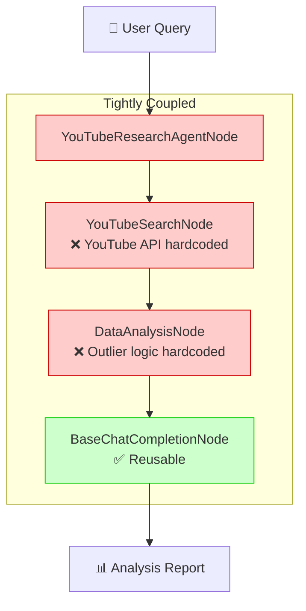
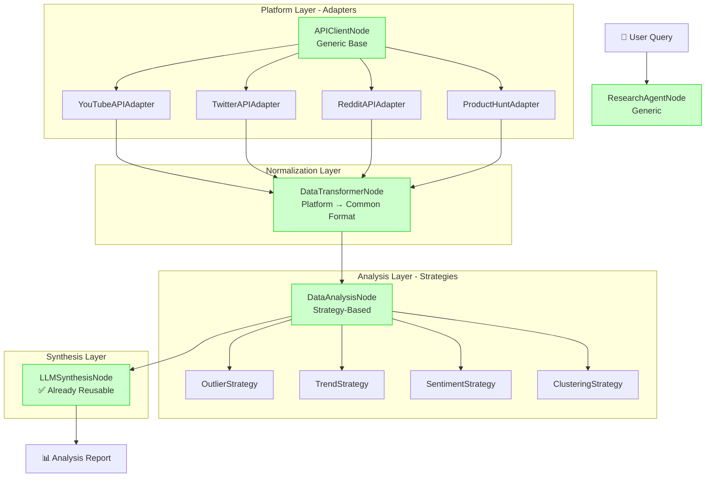
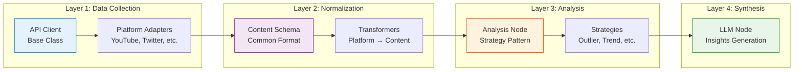
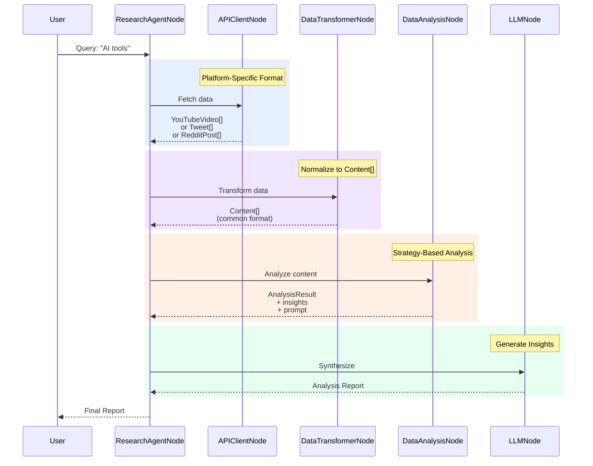
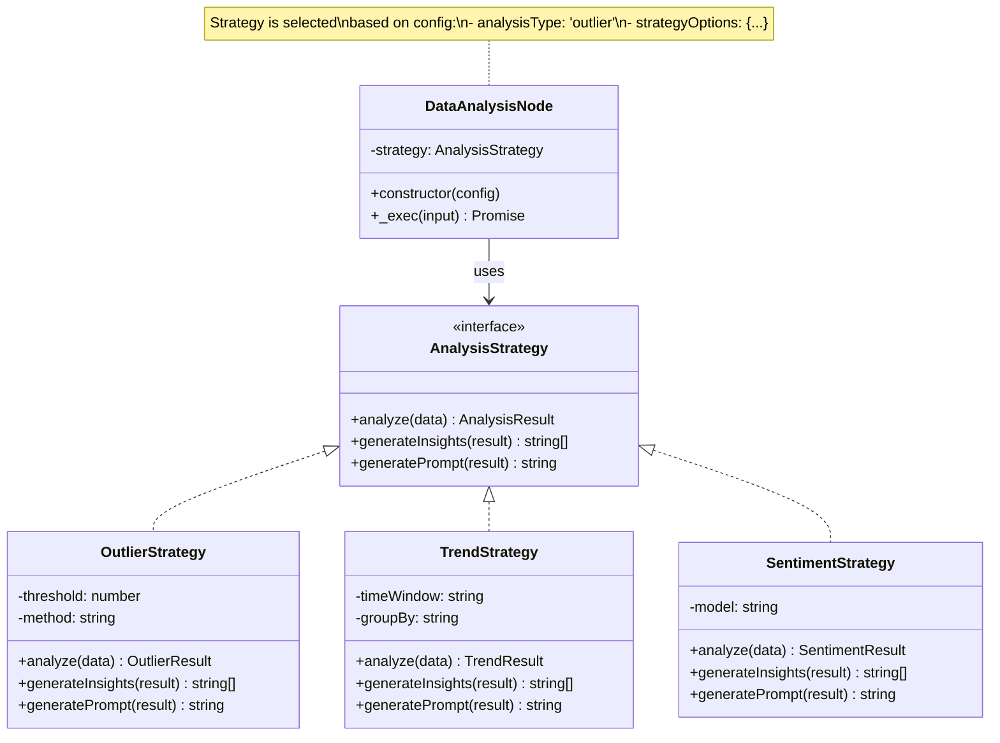
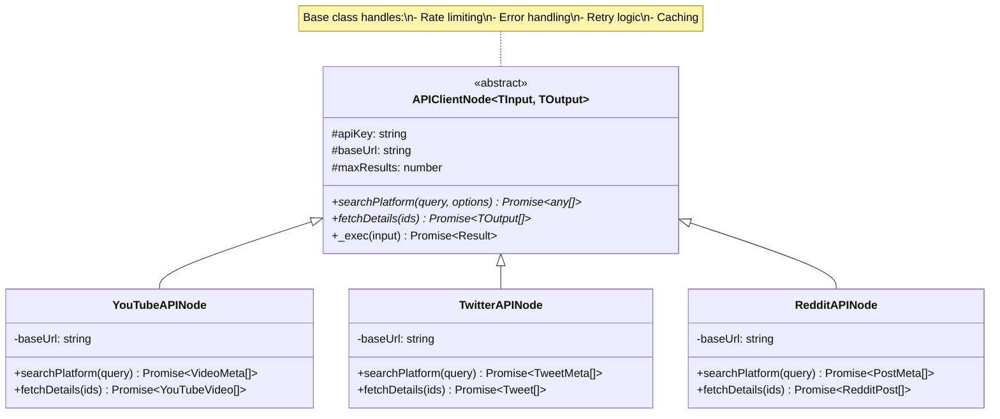
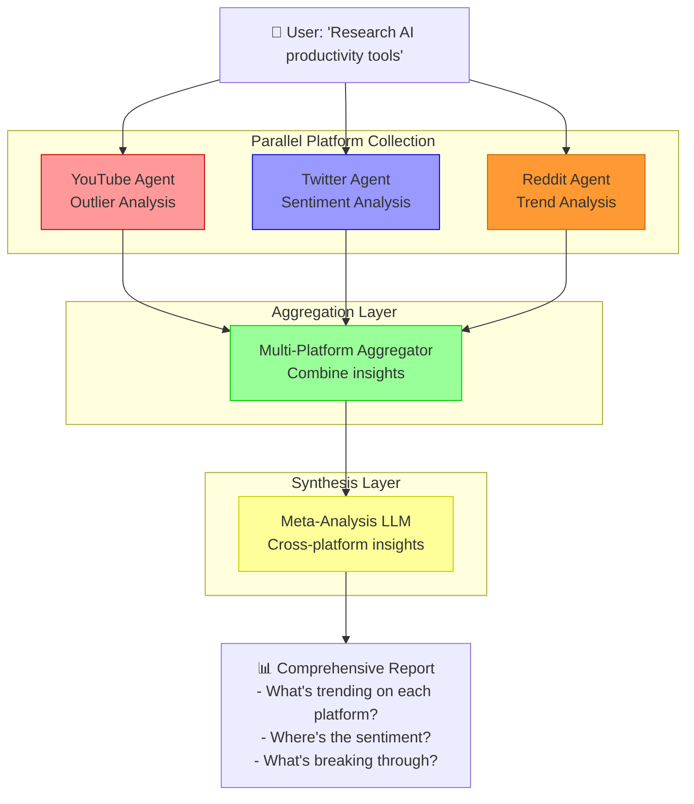
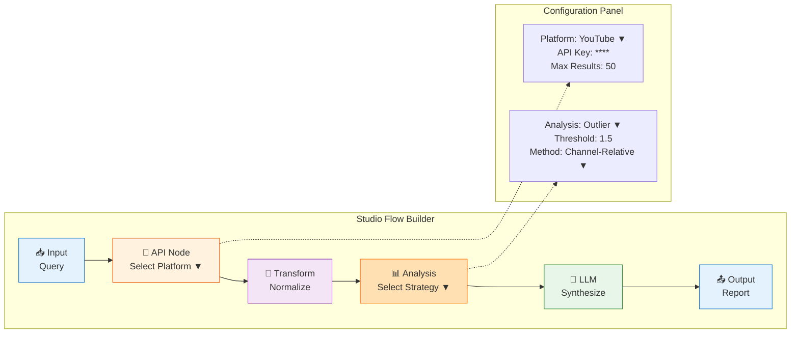
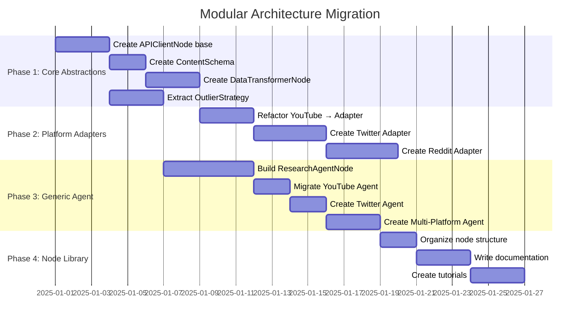

# Modular Architecture - Visual Reference

**Related:** [YouTube Agent Modularity Analysis](./ANALYSIS-YOUTUBE-AGENT-MODULARITY.md)

---

## 🏗️ Current vs. Proposed Architecture

### Current: Monolithic Agent



**Problems:**
- 🔴 Can't reuse for Twitter, Reddit, Product Hunt
- 🔴 Can't switch analysis strategies
- 🔴 Requires code changes for new platforms

---

### Proposed: Modular Plugin System



**Benefits:**
- ✅ Add new platforms without touching analysis code
- ✅ Switch analysis strategies via config
- ✅ Reuse components across agents
- ✅ Test each layer independently

---

## 🧩 Component Layering



---

## 🔄 Data Flow with Common Schema



---

## 📦 Node Library Organization

```
src/nodes/
│
├── 🎯 core/                        # Framework fundamentals
│   ├── backpack-node.ts           # Base class for all nodes
│   └── base-llm-node.ts           # Base LLM integration
│
├── 🔌 api-clients/                 # Platform integrations
│   ├── base-api-client.ts         # Abstract API client
│   ├── youtube-api.ts             # YouTube Data API v3
│   ├── twitter-api.ts             # Twitter API v2
│   ├── reddit-api.ts              # Reddit API
│   └── producthunt-api.ts         # Product Hunt API
│
├── 🔄 transformers/                # Data normalization
│   ├── data-transformer.ts        # Generic transformer
│   ├── content-schema.ts          # Common Content type
│   └── platform-transformers/
│       ├── youtube-transformer.ts
│       ├── twitter-transformer.ts
│       └── reddit-transformer.ts
│
├── 📊 analysis/                    # Data analysis
│   ├── data-analysis-node.ts      # Strategy-based analyzer
│   └── strategies/
│       ├── outlier-detection.ts   # Statistical outliers
│       ├── trend-analysis.ts      # Time-based trends
│       ├── sentiment-analysis.ts  # Sentiment scoring
│       └── clustering.ts          # Content clustering
│
├── 🤖 llm/                         # LLM nodes
│   ├── base-chat-completion.ts    # Generic LLM wrapper
│   ├── openai-node.ts             # OpenAI-specific
│   └── anthropic-node.ts          # Anthropic-specific
│
└── 🏢 agents/                      # Composite agents
    ├── research-agent.ts          # Generic research agent
    ├── youtube-agent.ts           # YouTube specialization
    ├── twitter-agent.ts           # Twitter specialization
    └── multi-platform-agent.ts    # Cross-platform agent
```

---

## 🎯 Strategy Pattern for Analysis



---

## 🔗 Adapter Pattern for APIs



---

## 🌐 Multi-Platform Agent Flow



---

## 🔧 Configuration-Driven Agent Building

### Example: YouTube Outlier Agent

```json
{
  "type": "ResearchAgentNode",
  "id": "youtube-outlier-agent",
  "config": {
    "platform": "youtube",
    "apiKey": "${YOUTUBE_API_KEY}",
    "maxResults": 50,
    "analysisType": "outlier",
    "analysisOptions": {
      "metric": "views",
      "threshold": 1.5,
      "method": "channel-relative"
    },
    "llm": {
      "model": "gpt-4",
      "temperature": 0.7,
      "systemPrompt": "You are a YouTube strategy analyst..."
    }
  }
}
```

### Example: Multi-Platform Trend Agent

```json
{
  "type": "MultiPlatformAgentNode",
  "id": "trend-scanner",
  "config": {
    "platforms": [
      {
        "name": "youtube",
        "analysisType": "trend",
        "options": { "timeWindow": "7d" }
      },
      {
        "name": "twitter",
        "analysisType": "sentiment",
        "options": { "model": "bert-base" }
      },
      {
        "name": "reddit",
        "analysisType": "trend",
        "options": { "groupBy": "subreddit" }
      }
    ],
    "aggregation": {
      "strategy": "weighted",
      "weights": {
        "youtube": 0.4,
        "twitter": 0.3,
        "reddit": 0.3
      }
    }
  }
}
```

---

## 🎨 Studio Visualization



**Studio Features:**
- 🎯 Drag & drop nodes from library
- 🔧 Configure via property panels
- 📊 Preview data flow between nodes
- 🧪 Test with sample data
- 💾 Export to JSON config
- 📤 Deploy to production

---

## 🚀 Migration Roadmap



**Total Timeline:** ~4 weeks (~20 working days)

---

## 📚 Related Documentation

- 📖 [YouTube Agent Modularity Analysis](./ANALYSIS-YOUTUBE-AGENT-MODULARITY.md)
- 📖 [PRD-004: Composite Nodes](./v2.0/prds/PRD-004-composite-nodes.md)
- 📖 [Studio Agent Guide](./STUDIO-AGENT-GUIDE.md)
- 📖 [BackpackFlow v2.0 Architecture](./v2.0/README.md)

---

**Questions?** Discuss the architecture in [GitHub Discussions](#) or open an issue!
