# BackpackFlow Studio: AI-First Orchestration Strategy

**Status:** 🎯 Strategic Vision  
**Date:** December 30, 2025  
**Related:** [Node Restructuring RFC](./NODE-RESTRUCTURING-RFC.md), [Framework Design Principles](./FRAMEWORK-DESIGN-PRINCIPLES.md)

---

## 🎯 **Vision Statement**

> **BackpackFlow Studio is an AI-first workflow builder where AI agents are the primary orchestrators, not humans.**

Instead of humans dragging and dropping nodes, **AI agents discover, compose, and optimize workflows** based on natural language requirements. Humans supervise, iterate, and approve—but the AI does the heavy lifting.

---

## 🚀 **The Paradigm Shift**

### **Traditional Workflow Builders (n8n, Zapier, Temporal)**

```mermaid
graph LR
    Human[👤 Human] -->|Drags & Drops| Studio[🎨 Visual Studio]
    Studio -->|Generates| Config[⚙️ Config]
    Config -->|Executes| Engine[🔧 Engine]
    
    style Human fill:#e3f2fd
    style Studio fill:#fff3e0
    style Config fill:#f3e5f5
    style Engine fill:#e8f5e9
```



**Limitations:**
- ❌ Humans must know all available nodes
- ❌ Humans must understand data flow
- ❌ Humans must manually wire connections
- ❌ Humans must debug and optimize
- ❌ Scales poorly with complexity

---

### **BackpackFlow AI-First Studio**

```mermaid
graph TB
    User[👤 User] -->|Natural Language| Prompt["'Build a research agent that<br/>analyzes Twitter sentiment<br/>and generates a report'"]
    
    Prompt -->|Requirement| AI[🤖 AI Orchestrator]
    
    subgraph "AI Discovery & Composition"
        AI -->|1. Discover| Registry[📚 NodeRegistry.list]
        Registry -->|Available Nodes| AI
        
        AI -->|2. Understand| Metadata[📋 Node Metadata<br/>inputs, outputs, config]
        Metadata -->|Schemas| AI
        
        AI -->|3. Compose| Flow[🔄 Flow Builder]
        Flow -->|Validate| Schemas[✅ Zod Validation]
        
        AI -->|4. Optimize| Variants[🔬 Generate Variants]
        Variants -->|Test| Best[🏆 Pick Best]
    end
    
    Best -->|Generate| Config[📄 JSON Config]
    Config -->|Execute| Engine[⚡ BackpackFlow Engine]
    Engine -->|Events| AI
    
    AI -->|Explains| User
    AI -->|Suggests Improvements| User
    User -->|Approves/Iterates| AI
    
    style User fill:#e3f2fd,stroke:#1976d2,stroke-width:3px
    style AI fill:#f3e5f5,stroke:#7b1fa2,stroke-width:4px
    style Config fill:#e8f5e9,stroke:#388e3c,stroke-width:2px
    style Engine fill:#fff3e0,stroke:#e65100,stroke-width:2px
```



**Benefits:**
- ✅ AI knows all available nodes (NodeRegistry)
- ✅ AI understands data flow (Zod schemas)
- ✅ AI auto-wires connections (type compatibility)
- ✅ AI optimizes and explains choices
- ✅ Scales infinitely with complexity

---

## 💡 **Why Node Restructuring is Critical**

The node restructuring isn't just "cleaner code"—it's **the foundation that makes AI orchestration possible**.

### **Without Restructuring: AI is Blind**

```typescript
// ❌ AI cannot discover nodes
// No registry, no metadata, manual imports required

// ❌ AI cannot understand nodes
class SomeNode {
    // Random properties, no schema, unclear purpose
    constructor(config: any) { /* ? */ }
}

// ❌ AI cannot compose nodes
// No input/output contracts, no validation, trial-and-error required

// ❌ AI cannot optimize
// No event history, no state snapshots, no way to compare runs
```

**Result:** AI would need to be **retrained** for every new node. Not scalable.

---

### **With Restructuring: AI is Empowered**

```typescript
// ✅ AI discovers all nodes
const nodes = NodeRegistry.list();
// Returns: [YouTubeSearchNode, TwitterAPINode, DataAnalysisNode, ...]

// ✅ AI understands each node
const node = NodeRegistry.get('TwitterAPINode');
console.log(node.getMetadata());
// {
//   displayName: "Twitter API",
//   description: "Search Twitter for tweets",
//   inputs: { query: z.string() },
//   outputs: { tweets: z.array(TweetSchema) },
//   config: { bearerToken: z.string(), maxResults: z.number() }
// }

// ✅ AI composes nodes
const compatible = checkDataFlow(
    twitterNode.outputs.tweets,      // z.array(TweetSchema)
    analysisNode.inputs.data          // z.array(ContentSchema)
);

// ✅ AI optimizes
const history = backpack.getHistory();
const events = eventStreamer.getHistory();
const improved = ai.optimizeFlow(history, events);
```

**Result:** AI learns **once**, works with **any node** that follows the pattern.

---

## 🎬 **User Experience Flow**

### **Scenario: User Wants to Research Trending AI Tools**

#### **Step 1: User Describes Goal**

```
User: "I want to find trending AI productivity tools on Twitter 
       and Reddit, analyze which ones have the best sentiment, 
       and create a report with recommendations."
```

---

#### **Step 2: AI Discovers Available Nodes**

```typescript
// AI Agent's internal process:
const availableNodes = NodeRegistry.list();

// AI filters by relevance
const relevantNodes = [
    NodeRegistry.get('TwitterAPINode'),    // For Twitter data
    NodeRegistry.get('RedditAPINode'),     // For Reddit data
    NodeRegistry.get('SentimentAnalysisNode'),  // For sentiment
    NodeRegistry.get('AggregatorNode'),    // For combining results
    NodeRegistry.get('LLMSynthesisNode')   // For report generation
];

// AI reads metadata for each
relevantNodes.forEach(node => {
    const meta = node.getMetadata();
    console.log(`${meta.displayName}: ${meta.description}`);
    console.log(`Inputs: ${Object.keys(meta.inputs)}`);
    console.log(`Outputs: ${Object.keys(meta.outputs)}`);
});
```

---

#### **Step 3: AI Composes Flow**

```typescript
// AI generates flow configuration
const flow = {
    namespace: 'trending-ai-tools-research',
    nodes: [
        {
            type: 'TwitterAPINode',
            id: 'twitter',
            params: {
                bearerToken: '${TWITTER_BEARER_TOKEN}',
                maxResults: 100
            }
        },
        {
            type: 'RedditAPINode',
            id: 'reddit',
            params: {
                clientId: '${REDDIT_CLIENT_ID}',
                clientSecret: '${REDDIT_CLIENT_SECRET}',
                maxPosts: 100
            }
        },
        {
            type: 'DataTransformerNode',
            id: 'transform-twitter',
            params: { platform: 'twitter' }
        },
        {
            type: 'DataTransformerNode',
            id: 'transform-reddit',
            params: { platform: 'reddit' }
        },
        {
            type: 'SentimentAnalysisNode',
            id: 'sentiment',
            params: {
                model: 'transformers',
                threshold: 0.7
            }
        },
        {
            type: 'AggregatorNode',
            id: 'aggregator',
            params: {
                strategy: 'weighted',
                weights: { twitter: 0.6, reddit: 0.4 }
            }
        },
        {
            type: 'LLMSynthesisNode',
            id: 'synthesis',
            params: {
                model: 'gpt-4',
                systemPrompt: 'You are an AI tools analyst...'
            }
        }
    ],
    edges: [
        { from: 'twitter', to: 'transform-twitter', action: 'complete' },
        { from: 'reddit', to: 'transform-reddit', action: 'complete' },
        { from: 'transform-twitter', to: 'sentiment', action: 'complete' },
        { from: 'transform-reddit', to: 'sentiment', action: 'complete' },
        { from: 'sentiment', to: 'aggregator', action: 'complete' },
        { from: 'aggregator', to: 'synthesis', action: 'complete' }
    ]
};

// AI validates flow
const validation = await validateFlow(flow);
if (!validation.valid) {
    // AI fixes issues
    flow = await ai.repairFlow(flow, validation.errors);
}
```

---

#### **Step 4: AI Validates Connections**

```typescript
// AI checks data flow compatibility
for (const edge of flow.edges) {
    const sourceNode = NodeRegistry.get(edge.from);
    const targetNode = NodeRegistry.get(edge.to);
    
    // Get Zod schemas
    const sourceOutputs = sourceNode.outputs;
    const targetInputs = targetNode.inputs;
    
    // Validate compatibility
    const compatible = checkSchemaCompatibility(sourceOutputs, targetInputs);
    
    if (!compatible.valid) {
        // AI suggests fixes
        console.log(`❌ Connection issue: ${edge.from} → ${edge.to}`);
        console.log(`Suggestion: Add transformer node to convert data`);
        
        // AI auto-fixes by inserting transformer
        flow = ai.insertTransformer(flow, edge);
    }
}
```

---

#### **Step 5: AI Explains the Flow**

```
AI: "I've created a multi-platform research flow:

1. 🐦 Twitter API: Fetches 100 recent tweets about 'AI productivity tools'
2. 🤖 Reddit API: Fetches 100 posts from r/SideProject and r/IndieBiz
3. 🔄 Transform: Normalizes both to common format (ContentSchema)
4. 📊 Sentiment Analysis: Uses transformer model to score each item
5. 🎯 Aggregator: Combines results with 60% Twitter, 40% Reddit weighting
6. 🤖 LLM Synthesis: Generates comprehensive report with recommendations

Estimated runtime: 45 seconds
Estimated cost: $0.15 (API calls + LLM tokens)

Would you like me to execute this flow?"
```

---

#### **Step 6: User Approves & AI Executes**

```
User: "Yes, but increase Reddit weight to 50/50"

AI: "Updated weights to 50/50. Executing flow..."

[Execution with real-time events]

AI: "✅ Flow completed in 42 seconds. Found 137 unique tools.
     Top 3 by sentiment:
     1. Cursor AI (0.92 sentiment, 1.2K mentions)
     2. v0.dev (0.89 sentiment, 890 mentions)
     3. Replit Agent (0.87 sentiment, 750 mentions)
     
     Full report generated. Would you like me to:
     - Export to PDF?
     - Schedule this to run daily?
     - Create a version for LinkedIn posts?"
```

---

#### **Step 7: AI Optimizes Based on Results**

```typescript
// AI observes execution
const events = eventStreamer.getHistory();
const backpackState = backpack.getHistory();

// AI notices Twitter API was rate-limited
const twitterEvents = events.filter(e => 
    e.sourceNode === 'twitter' && e.type === 'ERROR'
);

if (twitterEvents.length > 0) {
    // AI suggests improvement
    console.log(`⚠️ Twitter API hit rate limit.`);
    console.log(`Suggestion: Add CacheNode to reduce API calls.`);
    
    // AI generates improved flow
    const improvedFlow = ai.addCaching(flow, 'twitter');
    
    // AI explains
    console.log(`I've added a cache layer that will:
    - Store results for 1 hour
    - Reduce API calls by ~80%
    - Decrease cost from $0.15 to $0.03 per run`);
}
```

---

## 🏗️ **Technical Architecture**

### **The AI Agent Orchestrator**

```typescript
/**
 * AI Agent that builds and optimizes BackpackFlow workflows
 * 
 * Capabilities:
 * 1. Discover available nodes
 * 2. Understand node capabilities via metadata
 * 3. Compose valid flows with type checking
 * 4. Execute and observe results
 * 5. Learn and optimize over time
 */
export class AIFlowOrchestrator {
    private registry: typeof NodeRegistry;
    private llm: LLMClient;
    
    constructor(llmClient: LLMClient) {
        this.registry = NodeRegistry;
        this.llm = llmClient;
    }
    
    /**
     * Build a flow from natural language requirements
     */
    async buildFlow(userRequest: string): Promise<FlowConfig> {
        // 1. Discover relevant nodes
        const allNodes = this.registry.list();
        const relevantNodes = await this.selectRelevantNodes(userRequest, allNodes);
        
        // 2. Generate flow structure
        const flowStructure = await this.llm.generateFlowStructure({
            userRequest,
            availableNodes: relevantNodes.map(n => n.getMetadata()),
        });
        
        // 3. Validate and fix connections
        const validatedFlow = await this.validateAndRepair(flowStructure);
        
        // 4. Generate detailed configuration
        const completeFlow = await this.generateNodeConfigs(validatedFlow);
        
        return completeFlow;
    }
    
    /**
     * Select nodes relevant to user's request
     */
    private async selectRelevantNodes(
        userRequest: string,
        allNodes: NodeMetadata[]
    ): Promise<NodeMetadata[]> {
        // Use LLM to understand intent and select nodes
        const selection = await this.llm.complete({
            system: `You are a node selector. Given a user request and available nodes,
                     select the most relevant nodes for accomplishing the task.`,
            user: `Request: ${userRequest}
                   
                   Available nodes:
                   ${allNodes.map(n => `- ${n.displayName}: ${n.description}`).join('\n')}
                   
                   Select relevant node names (comma-separated):`,
        });
        
        const selectedNames = selection.split(',').map(n => n.trim());
        return allNodes.filter(n => selectedNames.includes(n.displayName));
    }
    
    /**
     * Validate flow and auto-repair issues
     */
    private async validateAndRepair(flow: Partial<FlowConfig>): Promise<FlowConfig> {
        const issues: string[] = [];
        
        // Check all connections
        for (const edge of flow.edges || []) {
            const sourceNode = this.registry.get(
                flow.nodes?.find(n => n.id === edge.from)?.type || ''
            );
            const targetNode = this.registry.get(
                flow.nodes?.find(n => n.id === edge.to)?.type || ''
            );
            
            if (!sourceNode || !targetNode) {
                issues.push(`Invalid edge: ${edge.from} → ${edge.to}`);
                continue;
            }
            
            // Check schema compatibility
            const compatible = this.checkCompatibility(
                sourceNode.outputs,
                targetNode.inputs
            );
            
            if (!compatible.valid) {
                issues.push(`Type mismatch: ${edge.from} → ${edge.to}: ${compatible.reason}`);
                
                // Auto-repair: Insert transformer
                const transformer = this.findTransformer(
                    sourceNode.outputs,
                    targetNode.inputs
                );
                
                if (transformer) {
                    // Insert transformer node
                    flow = this.insertNode(flow, edge, transformer);
                    issues.push(`Auto-fix: Inserted ${transformer.displayName}`);
                }
            }
        }
        
        if (issues.length > 0) {
            console.log('⚠️ Validation issues:', issues);
        }
        
        return flow as FlowConfig;
    }
    
    /**
     * Check if two Zod schemas are compatible
     */
    private checkCompatibility(
        sourceSchema: DataContract,
        targetSchema: DataContract
    ): { valid: boolean; reason?: string } {
        // Get matching keys
        const sourceKeys = Object.keys(sourceSchema);
        const targetKeys = Object.keys(targetSchema);
        
        const matchingKeys = sourceKeys.filter(k => targetKeys.includes(k));
        
        if (matchingKeys.length === 0) {
            return { 
                valid: false, 
                reason: 'No matching data keys between nodes' 
            };
        }
        
        // Check type compatibility for matching keys
        for (const key of matchingKeys) {
            const sourceType = sourceSchema[key];
            const targetType = targetSchema[key];
            
            // Use Zod's type checking
            try {
                const testData = sourceType.parse(/* sample */);
                targetType.parse(testData);
            } catch (error) {
                return { 
                    valid: false, 
                    reason: `Type mismatch on key '${key}': ${error.message}` 
                };
            }
        }
        
        return { valid: true };
    }
    
    /**
     * Execute flow and learn from results
     */
    async executeAndLearn(flow: FlowConfig): Promise<ExecutionResult> {
        const backpack = new Backpack({});
        const eventStreamer = new EventStreamer({ enableHistory: true });
        
        const flowInstance = new Flow({
            namespace: flow.namespace,
            backpack,
            eventStreamer,
        });
        
        // Load nodes
        const loader = new FlowLoader();
        for (const nodeConfig of flow.nodes) {
            const NodeClass = this.registry.get(nodeConfig.type);
            if (NodeClass) {
                loader.register(nodeConfig.type, NodeClass);
            }
        }
        
        // Execute
        const startTime = Date.now();
        await flowInstance.run({});
        const duration = Date.now() - startTime;
        
        // Analyze results
        const events = eventStreamer.getHistory();
        const finalState = backpack.getSnapshot();
        const errors = events.filter(e => e.type === 'ERROR');
        
        // Learn from execution
        const insights = await this.analyzeExecution({
            flow,
            events,
            finalState,
            duration,
            errors,
        });
        
        return {
            success: errors.length === 0,
            duration,
            insights,
            finalState,
        };
    }
    
    /**
     * Analyze execution and suggest improvements
     */
    private async analyzeExecution(data: ExecutionData): Promise<string[]> {
        const insights: string[] = [];
        
        // Check for performance issues
        const slowNodes = data.events
            .filter(e => e.type === 'EXEC_COMPLETE' && e.payload.durationMs > 5000)
            .map(e => e.sourceNode);
        
        if (slowNodes.length > 0) {
            insights.push(`⚠️ Slow nodes detected: ${slowNodes.join(', ')}`);
            insights.push(`💡 Suggestion: Add caching or parallel execution`);
        }
        
        // Check for errors
        if (data.errors.length > 0) {
            const errorNodes = [...new Set(data.errors.map(e => e.sourceNode))];
            insights.push(`❌ Errors in: ${errorNodes.join(', ')}`);
            insights.push(`💡 Suggestion: Check configuration or add retry logic`);
        }
        
        // Check for inefficiencies
        const apiCalls = data.events.filter(e => 
            e.sourceNode.includes('API') && e.type === 'EXEC_COMPLETE'
        ).length;
        
        if (apiCalls > 10) {
            insights.push(`⚠️ High API usage: ${apiCalls} calls`);
            insights.push(`💡 Suggestion: Implement batching or caching`);
        }
        
        return insights;
    }
}
```

---

## 🎯 **Why This Requires Restructured Nodes**

Let's trace through what the AI needs at each step:

| AI Action | Requires | Enabled By |
|-----------|----------|------------|
| **Discover nodes** | `NodeRegistry.list()` | ✅ Registry system |
| **Understand node** | Structured metadata | ✅ Auto-generated from Zod |
| **Check compatibility** | Input/output schemas | ✅ `static inputs`/`outputs` |
| **Generate config** | Parameter definitions | ✅ `static config` + zodToProperties |
| **Validate config** | Runtime validation | ✅ Auto-validation in constructor |
| **Observe execution** | Event stream | ✅ EventStreamer (already exists) |
| **Analyze state** | State history | ✅ Backpack (already exists) |
| **Optimize flow** | Performance data | ✅ Event payloads with timing |
| **Explain choices** | Human-readable metadata | ✅ Descriptions from Zod |

**Every single AI capability depends on the restructured node format!**

---

## 🚀 **Competitive Advantage**

### **Why BackpackFlow is Unique**

| Feature | n8n | Zapier | Temporal | **BackpackFlow** |
|---------|-----|--------|----------|------------------|
| Visual Builder | ✅ | ✅ | ❌ | ✅ |
| API-First | ✅ | ✅ | ✅ | ✅ |
| **AI Orchestration** | ❌ | ❌ | ❌ | ✅ |
| **Node Discovery** | Manual | Manual | Manual | **Programmatic** |
| **Type Validation** | Runtime | None | Compile | **Runtime + Compile** |
| **State History** | None | None | Limited | **Git-like** |
| **Event Streaming** | Basic | None | Basic | **Complete** |
| **Self-Optimizing** | ❌ | ❌ | ❌ | **✅ AI-driven** |

---

## 📊 **Success Metrics**

### **AI Orchestration KPIs**

1. **Node Reusability**
   - Target: 80%+ of workflows use existing nodes
   - No custom code required

2. **AI Success Rate**
   - Target: 90%+ of generated flows execute successfully
   - First try, no human debugging

3. **Time to Workflow**
   - Target: < 30 seconds from request to executable flow
   - AI generates, validates, explains

4. **Optimization Rate**
   - Target: 50%+ performance improvement after AI suggestions
   - Cost reduction, speed increase

5. **Human Supervision Ratio**
   - Target: 1 human supervises 10+ AI-generated workflows
   - Approve, not build

---

## 🎓 **Example: AI Learning Journey**

### **Day 1: First Research Agent**
```
User: "Research AI tools on Twitter"

AI: [Discovers TwitterAPINode, DataAnalysisNode, LLMSynthesisNode]
    [Generates flow, executes, learns patterns]
    "✅ Completed in 45s, found 120 tools"
```

### **Day 2: Similar Request**
```
User: "Research productivity tools on Reddit"

AI: [Recognizes pattern from Day 1]
    [Reuses: RedditAPINode, same analysis pipeline]
    "✅ Completed in 38s (7s faster due to cached learnings)"
```

### **Day 30: Complex Multi-Platform**
```
User: "Research trending dev tools across Twitter, Reddit, 
       Product Hunt, and Hacker News. Compare sentiment, 
       identify rising stars, generate investment memo."

AI: [Composes 4 API nodes + transformers + analysis + synthesis]
    [Applies 30 days of optimization learnings]
    [Adds caching, parallel execution, batch processing]
    "✅ Completed in 2m15s, analyzed 2,400 items across 4 platforms.
    Identified 15 rising stars. Would you like me to:
    - Set up daily monitoring?
    - Create alerts for specific criteria?
    - Export to Notion database?"
```

**The AI gets better over time because it learns from structured, consistent node patterns.**

---

## ✅ **Conclusion**

### **The Node Restructuring Enables:**

1. ✅ **AI can discover** nodes (NodeRegistry)
2. ✅ **AI can understand** nodes (metadata + Zod schemas)
3. ✅ **AI can compose** nodes (type-safe validation)
4. ✅ **AI can execute** nodes (BackpackFlow engine)
5. ✅ **AI can observe** execution (EventStreamer + Backpack)
6. ✅ **AI can optimize** flows (performance data + history)
7. ✅ **AI can explain** choices (human-readable metadata)
8. ✅ **AI can learn** patterns (consistent structure)

### **Without Restructuring:**
- ❌ AI is blind to available nodes
- ❌ AI cannot understand capabilities
- ❌ AI cannot validate compositions
- ❌ AI cannot optimize
- ❌ Every new node requires retraining

### **With Restructuring:**
- ✅ AI learns the pattern once
- ✅ Every new node is instantly usable
- ✅ Community contributions work automatically
- ✅ AI gets smarter over time
- ✅ Human supervision, not manual work

---

**This isn't just about clean code. This is about making BackpackFlow the first truly AI-native workflow orchestration platform.**

---

## 🚀 **Next Steps**

1. **Implement node restructuring** (enables AI orchestration)
2. **Build AI Orchestrator** (uses restructured nodes)
3. **Create Studio UI** (supervises AI, not builds manually)
4. **Train on patterns** (learns from executions)
5. **Launch AI-first workflows** (new paradigm)

---

**Related Documents:**
- [Node Restructuring RFC](./NODE-RESTRUCTURING-RFC.md)
- [Framework Design Principles](./FRAMEWORK-DESIGN-PRINCIPLES.md)
- [v2.0 Architecture](./v2.0/README.md)

---

**Last Updated:** December 30, 2025  
**Status:** Strategic Vision - Implementation Ready
