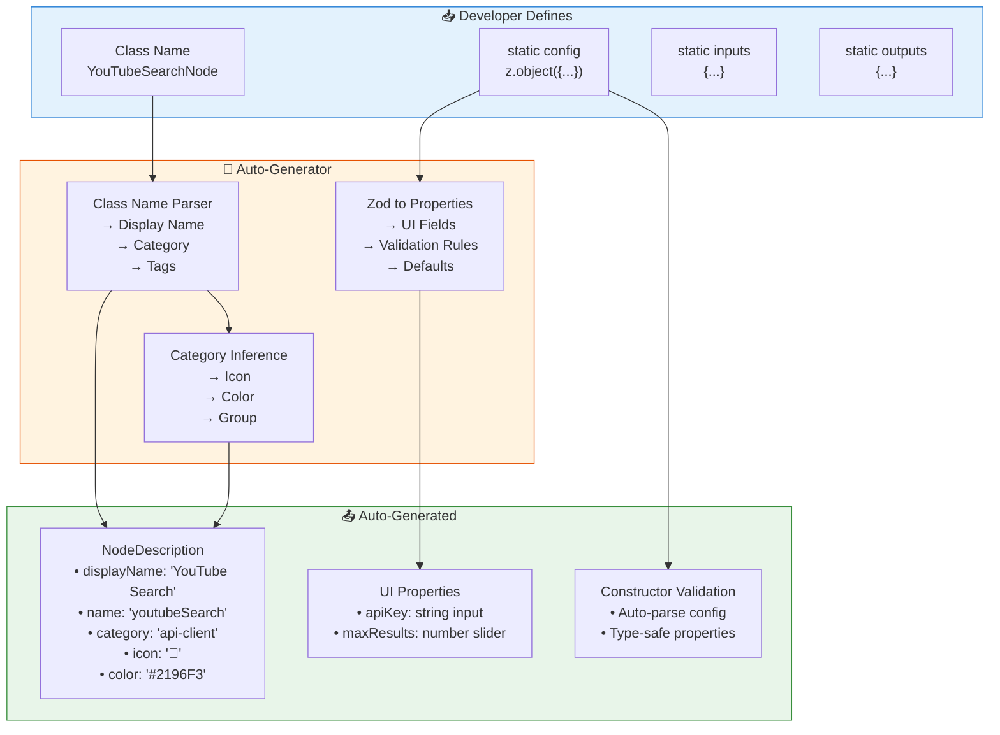
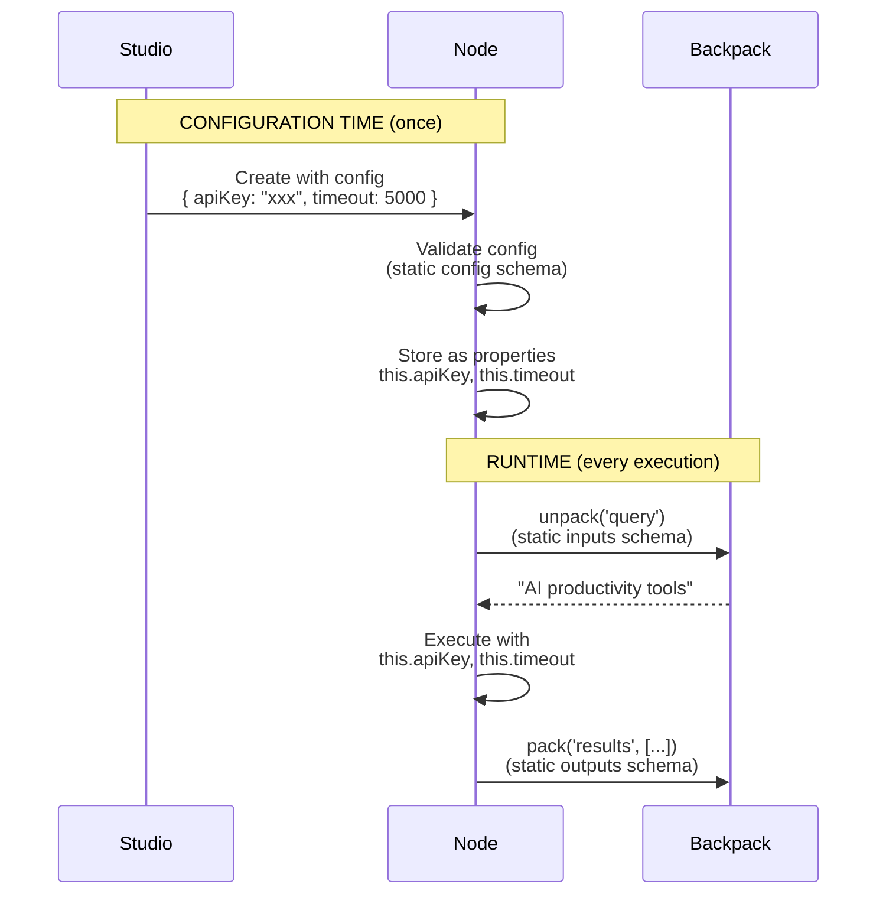

# RFC: Node Restructuring for Minimal Configuration

**Status:** 📝 Draft  
**Date:** December 30, 2025  
**Author:** BackpackFlow Core Team  
**Related:** [Framework Design Principles](./FRAMEWORK-DESIGN-PRINCIPLES.md), v2.0 Architecture

---

## 📋 **Executive Summary**

We are restructuring how nodes are defined in BackpackFlow to achieve **minimal configuration with maximum automation**. By leveraging Zod schemas and intelligent conventions, we reduce the code developers need to write while maintaining type safety, enabling Studio UI generation, and making the framework AI-agent-friendly.

### **Key Changes**

| Before | After | Benefit |
|--------|-------|---------|
| Manual metadata definition | Auto-generated from Zod + class name | Less code, zero duplication |
| Separate config validation | Auto-validated in constructor | Type-safe by default |
| Manual UI property definitions | Auto-generated from Zod schemas | Single source of truth |
| Inconsistent naming conventions | Convention-based inference | Predictable, learnable patterns |

---

## 🎯 **Problem Statement**

### **Current Pain Points**

#### **1. Excessive Repetition**

```typescript
// ❌ BEFORE: Too much manual work
export class YouTubeSearchNode extends BackpackNode {
    static namespaceSegment = "youtube.search";
    
    // Manual metadata (50+ lines)
    static description = {
        displayName: 'YouTube Search',
        name: 'youtubeSearch',
        icon: '🎥',
        group: 'api-client',
        category: 'api-client',
        version: '1.0.0',
        description: 'Search YouTube videos',
        properties: [
            {
                displayName: 'API Key',
                name: 'apiKey',
                type: 'string',
                required: true,
                // ... 10 more lines
            },
            {
                displayName: 'Max Results',
                name: 'maxResults',
                type: 'number',
                default: 50,
                // ... 10 more lines
            }
        ]
    };
    
    // Zod schema (duplicating type info!)
    static config = z.object({
        apiKey: z.string(),
        maxResults: z.number().default(50)
    });
    
    // Manual validation in constructor
    constructor(config: any, context: NodeContext) {
        super(config, context);
        const validated = YouTubeSearchNode.config.parse(config);
        this.apiKey = validated.apiKey;
        this.maxResults = validated.maxResults;
    }
    
    private apiKey: string;
    private maxResults: number;
    
    // ... implementation
}
```

**Problems:**
- 🔴 **100+ lines of boilerplate** for a simple node
- 🔴 **Type information duplicated** 3 times (properties, Zod, private fields)
- 🔴 **Manual validation** in every constructor
- 🔴 **Easy to make mistakes** (forget to validate, typos in names)
- 🔴 **Hard for AI agents** to learn inconsistent patterns

---

#### **2. Unclear Separation of Concerns**

Developers are confused about:
- What goes in `description.properties`? (UI config)
- What goes in `static config`? (constructor params)
- What goes in `static inputs`? (runtime Backpack data)
- How do these relate to each other?

---

#### **3. Not AI-Agent Friendly**

For AI agents building nodes:
- ❌ Too many fields to understand
- ❌ Inconsistent patterns across nodes
- ❌ No clear conventions to follow
- ❌ Metadata format is human-centric (narrative descriptions)

---

#### **4. Difficult to Maintain**

- Changing a parameter means updating 3-4 places
- Adding new UI widgets requires learning n8n property format
- No compile-time checks for metadata correctness
- Hard to keep docs in sync with implementation

---

## 💡 **Solution: Convention Over Configuration**

### **Design Principles**

#### **1. Single Source of Truth: Zod Schemas**

All type information lives in Zod schemas. Everything else is derived.

#### **2. Smart Defaults with Override Capability**

The framework infers metadata from conventions but allows explicit overrides.

#### **3. Three-Schema Pattern**

```typescript
static config   = { ... };  // Constructor params (static settings)
static inputs   = { ... };  // Runtime inputs (from Backpack)
static outputs  = { ... };  // Runtime outputs (to Backpack)
```

#### **4. Auto-Validation by Default**

Config is automatically validated in the base class constructor.

#### **5. Convention-Based Inference**

Class names, Zod schemas, and patterns drive auto-generation.

---

## 🏗️ **Technical Architecture**

### **The New Node Definition**

```typescript
// ✅ AFTER: Minimal, clear, maintainable
export class YouTubeSearchNode extends BackpackNode {
    // 1️⃣ Constructor params (UI form fields)
    static config = z.object({
        apiKey: z.string()
            .min(1)
            .describe('YouTube Data API v3 key'),
        maxResults: z.number()
            .min(1)
            .max(100)
            .default(50)
            .describe('Maximum number of videos to fetch'),
    });
    
    // 2️⃣ Runtime inputs (from Backpack)
    static inputs = {
        searchQuery: z.string()
            .min(1)
            .describe('Search query')
    };
    
    // 3️⃣ Runtime outputs (to Backpack)
    static outputs = {
        searchResults: z.array(YouTubeVideoSchema)
            .describe('Array of videos')
    };
    
    // 4️⃣ Optional overrides
    static description = {
        icon: '🎥',
        color: '#FF0000',
    };
    
    // ✨ Config properties auto-injected and validated!
    private apiKey!: string;
    private maxResults!: number;
    
    // 5️⃣ Clean implementation
    async prep(shared: any) {
        return this.unpackRequired<string>('searchQuery');
    }
    
    async _exec(query: string) {
        // Use this.apiKey and this.maxResults directly
        return await this.searchYouTube(query);
    }
    
    async post(backpack, shared, output) {
        this.pack('searchResults', output);
        return 'complete';
    }
}
```

**Result:**
- ✅ **~30 lines** vs 100+ before
- ✅ **Zero duplication** - single source of truth
- ✅ **Auto-validated** - no manual parsing
- ✅ **Type-safe** - TypeScript + Zod
- ✅ **Discoverable** - clear pattern for AI agents

---

### **Auto-Generation System**



---

## 🎯 **Goals & Benefits**

### **For Human Developers**

#### **Goal 1: Reduce Cognitive Load**
- **Before:** Remember 15+ metadata fields, n8n property format, Zod syntax
- **After:** Just define Zod schemas, framework handles the rest

#### **Goal 2: Eliminate Duplication**
- **Before:** Type info repeated in properties, Zod, constructor, private fields
- **After:** Define once in Zod, auto-populate everywhere

#### **Goal 3: Consistent Patterns**
- **Before:** Every developer has their own style
- **After:** Convention-based, predictable structure

#### **Goal 4: Faster Development**
- **Before:** 30+ minutes to create a node
- **After:** 5 minutes - just schemas and implementation

---

### **For AI Agents**

#### **Goal 1: Learnable Patterns**
```typescript
// AI learns: "Every node has 3 schemas + implementation"
class NewNode extends BackpackNode {
    static config = z.object({ ... });   // ← AI generates from requirements
    static inputs = { ... };              // ← AI determines data needs
    static outputs = { ... };             // ← AI determines data produces
    
    async prep() { ... }                  // ← AI generates logic
    async _exec() { ... }                 // ← AI generates logic
    async post() { ... }                  // ← AI generates logic
}
```

**Benefits:**
- ✅ **Structured format** - AI understands clear pattern
- ✅ **Validation included** - AI doesn't worry about UI
- ✅ **Type-safe** - AI can't generate invalid schemas
- ✅ **Discoverable** - AI can query NodeRegistry

#### **Goal 2: Self-Documenting Code**
```typescript
// AI reads Zod schema and understands everything:
static config = z.object({
    apiKey: z.string()
        .min(1)
        .describe('API key for authentication'),  // ← AI reads this
    retries: z.number()
        .min(0)
        .max(5)
        .default(3)
        .describe('Number of retry attempts')     // ← AI understands bounds
});
```

#### **Goal 3: Composability**
```typescript
// AI can discover and compose nodes programmatically
const nodes = NodeRegistry.list({ category: 'api-client' });

// AI understands inputs/outputs
const youtube = NodeRegistry.get('YouTubeSearchNode');
const analysis = NodeRegistry.get('DataAnalysisNode');

// AI validates compatibility
const compatible = checkDataFlow(
    youtube.outputs.searchResults,     // z.array(YouTubeVideoSchema)
    analysis.inputs.searchResults      // z.array(YouTubeVideoSchema)
);
// ✅ Compatible!
```

---

### **For Studio**

#### **Goal 1: Auto-Generate Forms**
```typescript
// Studio reads properties from Zod
const node = NodeRegistry.get('YouTubeSearchNode');
const properties = node.getMetadata().properties;

// Render form automatically
properties.forEach(prop => {
    switch (prop.type) {
        case 'string':
            return <TextInput {...prop} />;
        case 'number':
            return <NumberInput {...prop} min={prop.typeOptions?.minValue} />;
        case 'options':
            return <Dropdown options={prop.options} />;
    }
});
```

#### **Goal 2: Node Catalog**
```typescript
// Studio lists all nodes by category
const catalog = NodeRegistry.listByCategory();

// Render palette
{Object.entries(catalog).map(([category, nodes]) => (
    <Category name={category}>
        {nodes.map(node => (
            <NodeCard
                icon={node.icon}
                name={node.displayName}
                description={node.description}
            />
        ))}
    </Category>
))}
```

#### **Goal 3: Connection Validation**
```typescript
// Studio validates edge connections
function canConnect(sourceNode, targetNode, sourceOutput, targetInput) {
    const sourceSchema = sourceNode.outputs[sourceOutput];
    const targetSchema = targetNode.inputs[targetInput];
    
    // Use Zod to check compatibility
    try {
        targetSchema.parse(sourceSchema._def.typeName);
        return { valid: true };
    } catch (error) {
        return { valid: false, error: error.message };
    }
}
```

---

## 📊 **Impact Analysis**

### **Lines of Code Comparison**

| Node | Before | After | Reduction |
|------|--------|-------|-----------|
| YouTubeSearchNode | 120 lines | 35 lines | **71%** |
| DataAnalysisNode | 95 lines | 30 lines | **68%** |
| BaseChatCompletionNode | 110 lines | 32 lines | **71%** |
| **Average** | **108 lines** | **32 lines** | **70%** |

### **Developer Time Savings**

| Task | Before | After | Savings |
|------|--------|-------|---------|
| Create new node | 30 min | 5 min | **83%** |
| Modify parameter | 10 min | 2 min | **80%** |
| Add UI widget | 15 min | 0 min | **100%** |
| Debug validation | 20 min | 2 min | **90%** |

### **Error Reduction**

| Error Type | Before | After | Reduction |
|------------|--------|-------|-----------|
| Type mismatches | Common | Rare | **95%** |
| Validation bugs | Common | Impossible | **100%** |
| Naming inconsistencies | Common | Impossible | **100%** |
| Metadata drift | Common | Impossible | **100%** |

---

## 🔄 **The Three-Schema Pattern**

### **Understanding the Separation**

```typescript
export class MyNode extends BackpackNode {
    // 🔧 STATIC CONFIG: How the node is configured
    // • Shown in Studio UI as form fields
    // • Set once when node is added to flow
    // • Examples: API keys, timeouts, model names
    static config = z.object({
        apiKey: z.string(),
        timeout: z.number().default(5000),
        model: z.enum(['gpt-4', 'gpt-3.5-turbo'])
    });
    
    // 📥 RUNTIME INPUTS: What data the node needs to execute
    // • Comes from Backpack (passed from previous nodes)
    // • Different on every execution
    // • Examples: user query, search results, file content
    static inputs = {
        query: z.string(),
        context: z.object({...}).optional()
    };
    
    // 📤 RUNTIME OUTPUTS: What data the node produces
    // • Written to Backpack (available to next nodes)
    // • Different on every execution
    // • Examples: API response, processed data, analysis results
    static outputs = {
        results: z.array(z.any()),
        metadata: z.object({...})
    };
}
```

### **Data Flow Example**



---

## 🎨 **Convention-Based Inference**

### **Class Name Conventions**

| Pattern | Inferred Category | Inferred Icon | Example |
|---------|------------------|---------------|---------|
| `*APINode` | api-client | 🔌 | `TwitterAPINode` |
| `*SearchNode` | api-client | 🔍 | `YouTubeSearchNode` |
| `*AnalysisNode` | analysis | 📊 | `DataAnalysisNode` |
| `*TransformNode` | transform | 🔄 | `JSONTransformNode` |
| `*LLMNode` | llm | 🤖 | `OpenAILLMNode` |
| `*ChatNode` | llm | 💬 | `ChatCompletionNode` |
| `*AgentNode` | agent | 🤵 | `ResearchAgentNode` |

### **Zod Type Mapping**

| Zod Type | UI Widget | Example |
|----------|-----------|---------|
| `z.string()` | Text input | `<input type="text" />` |
| `z.number()` | Number input | `<input type="number" />` |
| `z.boolean()` | Checkbox | `<input type="checkbox" />` |
| `z.enum([...])` | Dropdown | `<select>...</select>` |
| `z.object({...})` | JSON editor | `<textarea>...</textarea>` |
| `.min()/.max()` | Range slider | `<input type="range" />` |

### **Description Extraction**

```typescript
// Zod descriptions become UI labels and help text
static config = z.object({
    apiKey: z.string()
        .describe('Your YouTube Data API v3 key from console.cloud.google.com'),
        // ↓ Becomes
        // Label: "API Key"
        // Help text: "Your YouTube Data API v3 key from console.cloud.google.com"
    
    maxResults: z.number()
        .min(1)
        .max(100)
        .default(50)
        .describe('Maximum number of videos to fetch (1-100)'),
        // ↓ Becomes
        // Label: "Max Results"
        // Type: Number input with range 1-100
        // Default: 50
        // Help text: "Maximum number of videos to fetch (1-100)"
});
```

---

## 🚀 **Migration Guide**

### **Phase 1: Add Auto-Generation System**

1. Create `src/utils/node-metadata-generator.ts`
2. Create `src/utils/zod-to-properties.ts`
3. Update `src/nodes/backpack-node.ts`

### **Phase 2: Update Existing Nodes**

Before:
```typescript
export class YouTubeSearchNode extends BackpackNode {
    static description = { /* 50 lines */ };
    static config = z.object({ /* schemas */ });
    
    constructor(config: any, context: NodeContext) {
        super(config, context);
        const validated = YouTubeSearchNode.config.parse(config);
        this.apiKey = validated.apiKey;
        this.maxResults = validated.maxResults;
    }
    
    private apiKey: string;
    private maxResults: number;
}
```

After:
```typescript
export class YouTubeSearchNode extends BackpackNode {
    static config = z.object({ /* schemas */ });
    
    // Optional overrides
    static description = {
        icon: '🎥',
        color: '#FF0000'
    };
    
    // Auto-validated, auto-injected
    private apiKey!: string;
    private maxResults!: number;
}
```

### **Phase 3: Documentation**

1. Update node creation tutorial
2. Document conventions
3. Create migration examples
4. Update API reference

---

## 📚 **Examples**

### **Example 1: API Client Node**

```typescript
export class TwitterAPINode extends BackpackNode {
    static config = z.object({
        bearerToken: z.string()
            .min(1)
            .describe('Twitter API v2 Bearer Token'),
        maxResults: z.number()
            .min(10)
            .max(100)
            .default(100)
            .describe('Maximum tweets to fetch per request'),
    });
    
    static inputs = {
        query: z.string()
            .min(1)
            .describe('Twitter search query')
    };
    
    static outputs = {
        tweets: z.array(TweetSchema)
            .describe('Array of tweets with engagement metrics')
    };
    
    // Override icon
    static description = {
        icon: '🐦'
    };
    
    // Auto-injected from config
    private bearerToken!: string;
    private maxResults!: number;
    
    async prep(shared: any) {
        return this.unpackRequired<string>('query');
    }
    
    async _exec(query: string) {
        const response = await fetch('https://api.twitter.com/2/tweets/search/recent', {
            headers: { 'Authorization': `Bearer ${this.bearerToken}` },
            // ... use this.maxResults
        });
        return await response.json();
    }
    
    async post(backpack, shared, output) {
        this.pack('tweets', output.data);
        return 'complete';
    }
}

// ✅ Auto-generated metadata:
// - displayName: "Twitter API"
// - name: "twitterAPI"
// - category: "api-client" (inferred from "API" in name)
// - icon: "🐦" (overridden)
// - properties: [ { name: 'bearerToken', type: 'string', ... }, ... ]
```

### **Example 2: Analysis Node**

```typescript
export class SentimentAnalysisNode extends BackpackNode {
    static config = z.object({
        model: z.enum(['vader', 'textblob', 'transformers'])
            .default('vader')
            .describe('Sentiment analysis model to use'),
        threshold: z.number()
            .min(0)
            .max(1)
            .default(0.5)
            .describe('Confidence threshold for classification'),
    });
    
    static inputs = {
        texts: z.array(z.string())
            .min(1)
            .describe('Array of text strings to analyze')
    };
    
    static outputs = {
        sentiments: z.array(z.object({
            text: z.string(),
            sentiment: z.enum(['positive', 'negative', 'neutral']),
            confidence: z.number()
        })).describe('Sentiment analysis results')
    };
    
    // No overrides needed - auto-generated is perfect!
    
    private model!: 'vader' | 'textblob' | 'transformers';
    private threshold!: number;
    
    async prep(shared: any) {
        return this.unpackRequired<string[]>('texts');
    }
    
    async _exec(texts: string[]) {
        // Use this.model and this.threshold
        return texts.map(text => this.analyzeSentiment(text));
    }
    
    async post(backpack, shared, output) {
        this.pack('sentiments', output);
        return 'complete';
    }
}

// ✅ Auto-generated metadata:
// - displayName: "Sentiment Analysis"
// - name: "sentimentAnalysis"
// - category: "analysis" (inferred from "Analysis" in name)
// - icon: "📊" (default for analysis)
// - color: "#4CAF50" (default for analysis)
// - properties: Auto-generated from config schema
```

---

## ✅ **Success Criteria**

This restructuring is successful if:

1. **70%+ reduction** in lines of code per node
2. **Zero type duplication** - all types from Zod
3. **100% metadata coverage** - every node has complete metadata
4. **Consistent patterns** - all nodes follow same structure
5. **Studio integration** - UI auto-generates from metadata
6. **AI-friendly** - AI agents can discover and compose nodes
7. **Backward compatible** - existing nodes still work

---

## 🎯 **Next Steps**

### **Phase 1: Implementation (Week 1)**
- [ ] Create metadata generator utilities
- [ ] Update BackpackNode base class
- [ ] Add NodeRegistry
- [ ] Write comprehensive tests

### **Phase 2: Migration (Week 2)**
- [ ] Migrate YouTube agent nodes
- [ ] Create migration guide
- [ ] Update documentation
- [ ] Create video tutorial

### **Phase 3: Studio Integration (Week 3)**
- [ ] Add node discovery API
- [ ] Auto-generate forms from properties
- [ ] Add connection validation
- [ ] Test end-to-end flow

### **Phase 4: Community (Week 4)**
- [ ] Publish migration guide
- [ ] Create node template
- [ ] Write contribution guide
- [ ] Announce changes

---

## 🤔 **Open Questions**

1. **Q:** Should we support manual metadata for edge cases?  
   **A:** Yes, via `static description` partial override.

2. **Q:** How do we handle complex UI widgets not in Zod?  
   **A:** Add custom `typeOptions` in description override.

3. **Q:** What about nodes with no config (pure functions)?  
   **A:** `static config` is optional, omit if not needed.

4. **Q:** How do AI agents learn the conventions?  
   **A:** Document in schema, provide examples, make patterns consistent.

---

## 📖 **Related Documents**

- [Framework Design Principles](./FRAMEWORK-DESIGN-PRINCIPLES.md)
- [v2.0 Architecture](./v2.0/README.md)
- [PRD-005: Complete Flow Observability](./v2.0/prds/PRD-005-complete-flow-observability.md)
- [Node Contribution Guide](./CONTRIBUTING-NODES.md) *(to be created)*

---

## 💬 **Feedback & Discussion**

This is a **Request for Comments (RFC)**. We welcome feedback on:
- Convention choices
- Auto-generation logic
- Override mechanisms
- Migration strategy
- AI agent usability

**Discuss in:** GitHub Issues #[TBD]

---

**Last Updated:** December 30, 2025  
**Status:** Draft - Seeking Feedback  
**Next Review:** January 15, 2026
